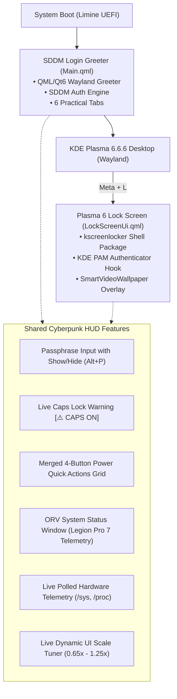

# Chapter 14: NieR:Automata Cyberpunk Suite (SDDM Greeter & KDE Plasma 6 Lock Screen)

## Overview & Architecture

The **NieR:Automata Cyberpunk Suite** delivers a cohesive, ultra-high-fidelity, and practical HUD experience across both the system boot manager (**SDDM**) and the active desktop session lock screen (**KDE Plasma 6 `kscreenlocker`**).



---

## 1. SDDM Login Greeter Theme

* **Source Directory**: `/home/l41n-pr0t0/Documents/SDDM_Themes/nier-automata/`
* **NixOS Declarative Derivation**: `/etc/nixos/pkgs/sddm-nier-automata/default.nix`
* **NixOS System Setting**:
  ```nix
  services.displayManager.sddm = {
    enable = true;
    package = pkgs.kdePackages.sddm;
    wayland.enable = true;
    theme = "nier-automata";
    extraPackages = with pkgs.kdePackages; [
      qt5compat
      qtsvg
      qtmultimedia
    ];
  };
  ```

### Key Technical Capabilities:
1. **Interactive Show/Hide Password Toggle**:
   - Integrated eye icon (`👁 / 🔒`) and `Alt + P` keyboard shortcut.
2. **Live Caps Lock Detection**:
   - Direct binding to `keyboard.capsLock` displaying `[⚠️ CAPS ON]` and warning status.
3. **Merged 4-Button Power Action Grid**:
   - Quick one-click execution of `sddm.suspend()`, `sddm.reboot()`, `sddm.powerOff()`, and `sddm.hibernate()` directly under the passphrase box.
4. **Crystal-Clear Video Wallpaper Playback**:
   - Plays `/home/l41n-pr0t0/Documents/SDDM_Themes/nier-automata/bg.mp4` with zero yellowish tint or color washing.

---

## 2. KDE Plasma 6 Lock Screen Package (`kscreenlocker`)

* **Package Location**: `~/.local/share/plasma/shells/org.kde.plasma.desktop/`
* **Package Metadata (`metadata.json`)**:
  ```json
  {
      "KPlugin": {
          "Id": "org.kde.plasma.desktop",
          "Name": "Desktop",
          "Description": "Desktop shell for KDE Plasma 6",
          "KPackageStructure": "Plasma/Shell"
      },
      "X-Plasma-APIVersion": "2"
  }
  ```
* **QML Entrypoint**: `contents/lockscreen/LockScreen.qml`
* **Main UI Component**: `contents/lockscreen/LockScreenUi.qml`

### Integration Details:
1. **KDE PAM Authenticator**:
   - Connects to `authenticator.respond(pwInput.text)` upon pressing `Enter` or clicking `▶`.
   - Listens to `authenticator.onSucceeded -> Qt.quit()` to dismiss the locker and unlock the Wayland desktop seamlessly.
   - Listens to `authenticator.onFailed -> ACCESS DENIED` with a red glitch animation.
2. **Smart Video Wallpaper Overlay**:
   - Integrates cleanly on top of `io.github.luisbocanegra.smartvideowallpaper` rendering `/home/l41n-pr0t0/Videos/Untitled design.mp4`.
   - Translucent glass panels (`rgba(20, 19, 16, 0.94)`) protect text readability without degrading video colors.

---

## 3. The Omniscient Reader's Viewpoint (ORV) System Status Window

Redesigned inside the `HARDWARE` tab based on the Dokkaebi Holographic Scenario Window from *Omniscient Reader's Viewpoint*:

```
  ┌──▀───────────────────────────────────────────────────────────────────┐
 ╱                                                               [—][⧉][✕]│
│                                                                        │
│                  < HARDWARE SPECIFICATION & ATTRIBUTES >               │
│                                                                        │
│   HOST PLATFORM:        LENOVO Legion Pro 7 16IRX8H (Type 82WQ)        │
│   OPERATING SYSTEM:     NixOS 26.05 (x86_64) // Linux 6.18.46 (64-bit) │
│   DESKTOP RUNTIME:      KDE Plasma 6.6.6 // Frameworks 6.26.0 // Qt 6.11│
│   PRIMARY PROCESSOR:    32 × 13th Gen Intel® Core™ i9-13900HX (5.40 GHz)│
│   DISCRETE GRAPHICS:    NVIDIA GeForce RTX 4090 Laptop GPU (16GB GDDR6)│
│   INTEGRATED GRAPHICS:  Mesa Intel® UHD Graphics (Raptor Lake-HX)      │
│   DISPLAY PANEL:        16.0" 16:10 WQXGA (2560 × 1600) IPS @ 240 Hz  │
│   AUDIO SUBSYSTEM:      Texas Instruments TAS2781 Dual Smart-Amps      │
│   POWER & BATTERY:      80% (AC ONLINE) // 99.9 Wh Li-Ion (330W Supply)│
│   SYSTEM TELEMETRY:     Load: 1.24, 1.45, 1.10  |  Uptime: 0h 18m 42s  │
│   RAM ALLOCATION:       [████████░░░░░░░░░░░░░░░░░░░░] 4.2 / 31.1 GB   │
│                                                                      ╱ ╱
└─────────────────────────────────────────────────────────────▀───────╱ ╱
```

### Visual Specifications:
* **Chamfered Top-Left Corner Cut**: Clean vector angled chamfer.
* **Bottom-Right Corner Stripes**: 45° diagonal accent hatched lines (`///`).
* **Window Buttons**: `[ — ] [ ⧉ ] [ ✕ ]` in the top right.
* **Perimeter Notches**: Holographic square pixel chips along outer borders.
* **Live DDR5 RAM Gauge**: Real-time memory allocation bar parsed from `/proc/meminfo`.

---

## 4. Tab Navigation Reference

| Tab Name | Shortcut | Purpose |
| :--- | :--- | :--- |
| **`UNLOCK` / `LOGIN`** | `Alt + 1` / `Esc` | Passphrase authentication, Show/Hide eye, CapsLock alert, Quick Power buttons. |
| **`HARDWARE`** | `Alt + 2` | ORV System Status Window with Legion Pro 7, RTX 4090, i9-13900HX, and live DDR5 telemetry. |
| **`NETWORK`** | `Alt + 3` | Wi-Fi 6E AX211, local subnet, default gateway, Bluetooth 5.3, and IPTables firewall status. |
| **`DISPLAY`** | `Alt + 4` | Live UI scale tuner (`[-] 0.90x [+]`), 2560x1600@240Hz display specs, TAS2781 amp profiles. |
| **`DIAGS`** | `Alt + 5` | Software matrix: NixOS 26.05, Linux 6.18.46 LTS, KDE Plasma 6.6.6, Qt 6.11.1, KWin Wayland. |
| **`SHORTCUTS`** | `Alt + 6` | Emergency TTY recovery console reference (`Ctrl+Alt+F3`) and navigation cheatsheet. |

---

## 5. Verification & Testing Commands

```bash
# Safe Window Test for KDE Plasma Lock Screen
/nix/store/l8w1rp05b2nnjbz9hg14nil8zipfnkf1-kscreenlocker-6.6.6/libexec/kscreenlocker_greet --testing

# Safe Window Test for SDDM Theme
/run/current-system/sw/bin/sddm-greeter-qt6 --test-mode --theme /home/l41n-pr0t0/Documents/SDDM_Themes/nier-automata

# Live Lock Screen Test
Press Meta + L
```
